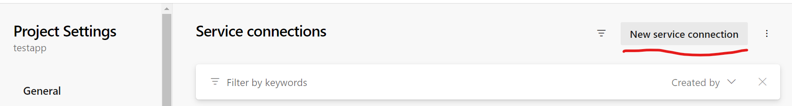
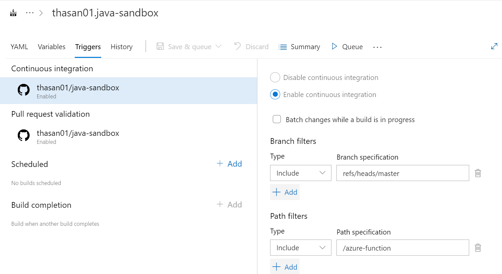

# Setup Azure DevOps

## Table of Content

1. [Prerequisites](#prerequisites)
2. [Create Service Principal](#create-service-principal)
3. [Service Connection Setup](#service-connection-setup)
4. [Repository Setup](#repository-setup)
5. [Troubleshooting](#troubleshooting)

## Prerequisites

- From [Azure Portal](https://portal.azure.com) create an **Azure DevOps Organization**.


- Assuming the **DevOps Organization** is Free-Teir, fill out [Azure DevOps Parallelism Request](https://forms.office.com/pages/responsepage.aspx?id=v4j5cvGGr0GRqy180BHbR63mUWPlq7NEsFZhkyH8jChUMlM3QzdDMFZOMkVBWU5BWFM3SDI2QlRBSC4u) form and submit it. It takes a few days to fulfill.

## Create Service Principal

Using Azure CLI, run the following command:

```
az ad sp create-for-rbac --name <ACCOUNT_NAME> --role Contributor --scopes /subscriptions/<SUBSCRIPTION_ID>/resourceGroups/<RESOURCE_GROUP>
```

The output will be the format below. Store it somewhere safe.

```javascript
{
  "appId": "abc123-abc123-abc123-abc123-abc123",
  "displayName": "some-human-readable-user-name",
  "password": "sUp3R-Sec43t",
  "tenant": "aaaaaaaaaa-bbbb-1111-cccc-abc123xyz456"
}
```

## Service Connection Setup

Go to your **DevOps Organization** and select **Project setting** in the bottom.


Select **Service connection**


Then select **New service connection**



Then select **Azure Resource manager**


Select **Service principal (manual)**


In the **New Azure service connection** page:

Set **Scope level** to **Subscription**

- Get the values of **Subscription Name**, **Subscription Id\***, and **Resource Group** from the Azure Function Overview page from the Azure portal.
- Get following values from [Create Service Principal](#create-service-principal) section
  - **appId** as **Service Principal Id**
  - **password** as **Service principal key**
  - **tenant** as **Tenant Id**
- Under **Credential** check the **Service principal key** radio button.
- Set a service connection name and click **Verify and save**


## Repository Setup

Go to your **DevOps Organization** (Ex: https://dev.azure.com/<org_name>/<projectname>)

Select **Pipelines** on the left


Select **New Pipeline**


Select **GitHub**


Login to GitHub


Grant Azure DevOps access to your GitHub repo.


You will be redirected back to Azure DevOps page. Select a repo from GitHub.


Approve and Install the DevOps application in GitHub


Select **Maven**


Update the location & content of **azure-pipelines.yaml**, then click **Save and run**


Either commit the new changes (azure-pipelines.yaml) directly to the master branch or create a new branch in the repository.

Then click **Save**


## Other Settings

From Pipeline page select **Setings**


Select the **Override the YAML continuous integration trigger from here** checkbox.

Click **Add** button under **Path Filters** and add the path to the Azure project.

Only commits under this path will triger the DevOps pipeline.

Click **Save & queue**.



## Troubleshooting

### :x: Resource Doesn't Exist

> ##[error]Error: Resource '**\***' doesn't exist. Resource should exist before deployment.

Common cause of this error are:

- Immediately trying to run the pipeline after creating the Azure Function
- The Service Principal does not have proper permission to the Resource Group of the Azure Function

First confirm the Service Principal has the "Contibutor" role in the scope.

```
az role assignment list --assignee <SERVICE_PRINCIPAL_ID> --role Contributor --scope <SCOPE>
```

If not, then add it

```
az role assignment create --assignee <SERVICE_PRINCIPAL_ID> --role Contributor --scope <SCOPE>
```

**<SERVICE_PRINCIPAL_ID>** and **<SCOPE>** are **appId** and **scope** from [Create Service Principal](#create-service-principal)

**Reference Links**

- [az role assignment](https://learn.microsoft.com/en-us/cli/azure/role/assignment?view=azure-cli-latest)
