#Google Cloud Platform Project Setup

##Create New GCP Project
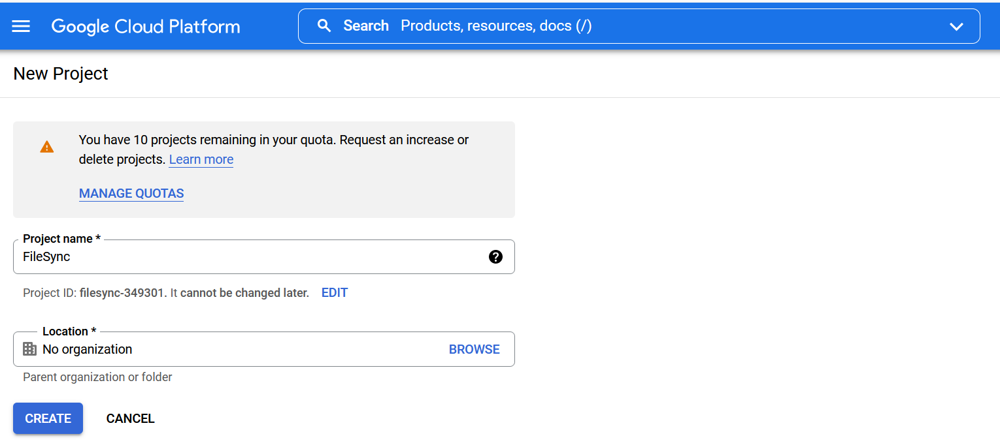
  
  
##Enable Drive API
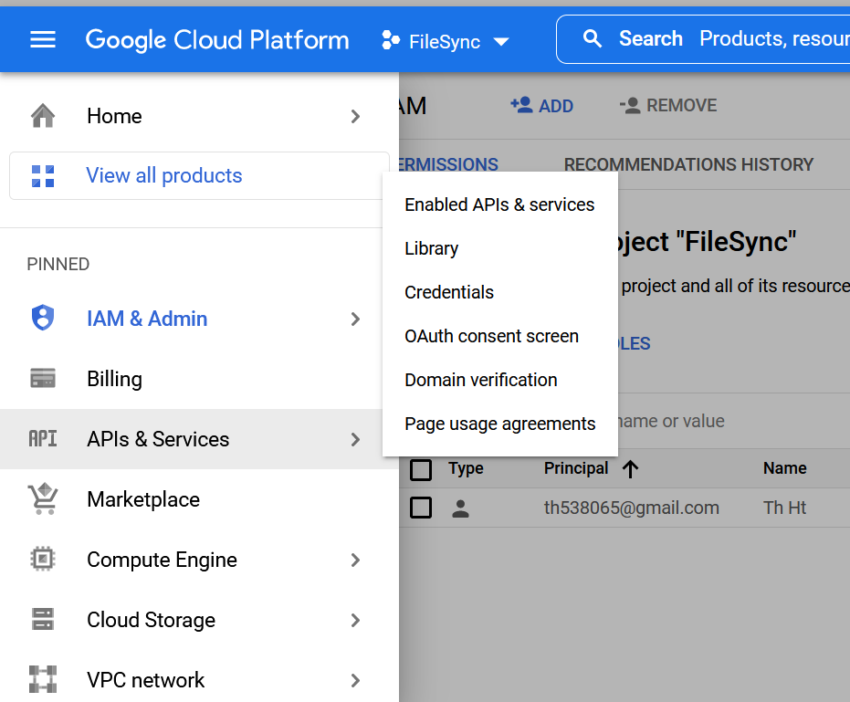
  
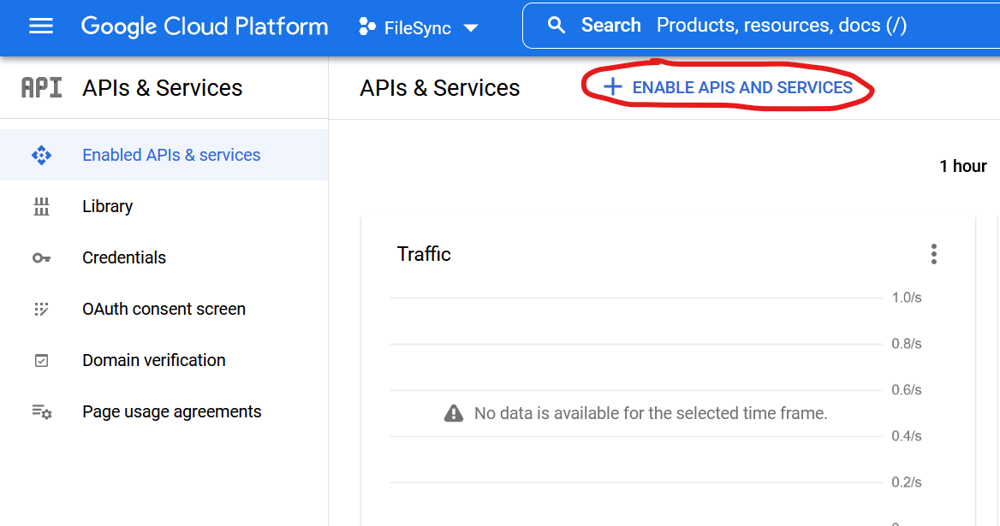
  
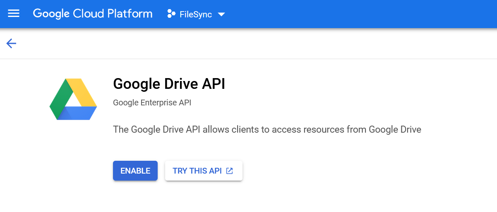
  
  
##Configure OAuth consent screen
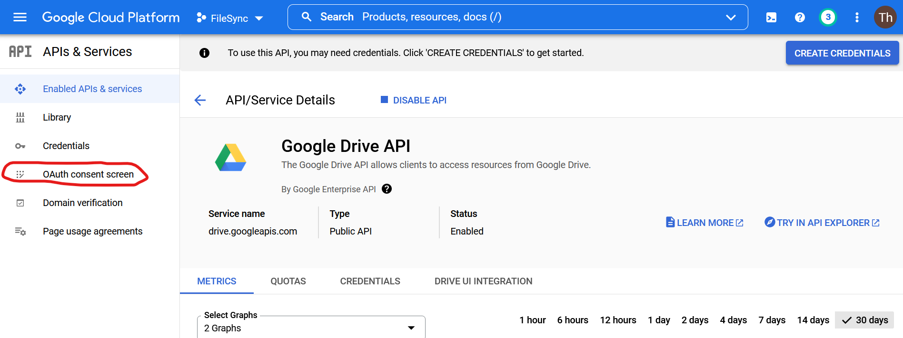
  
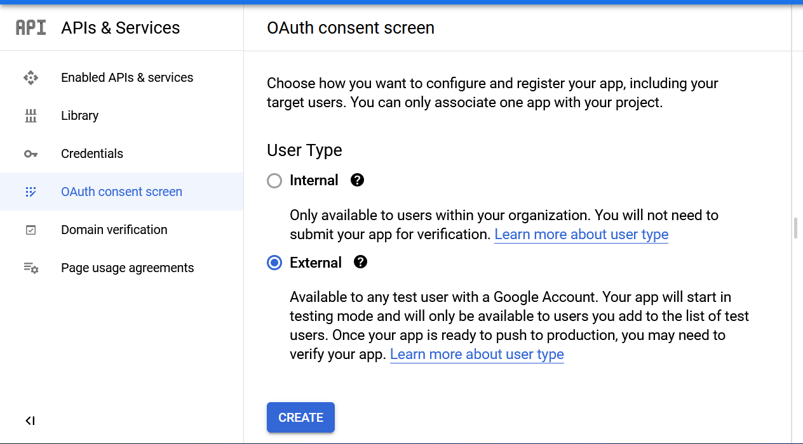
  
Fill out **App Information** screen, and click **Save and Continue**.  
  
In the **Scopes** screen, select **drive.file** and **drive.appdata** scopes, and click **Update**.  
  
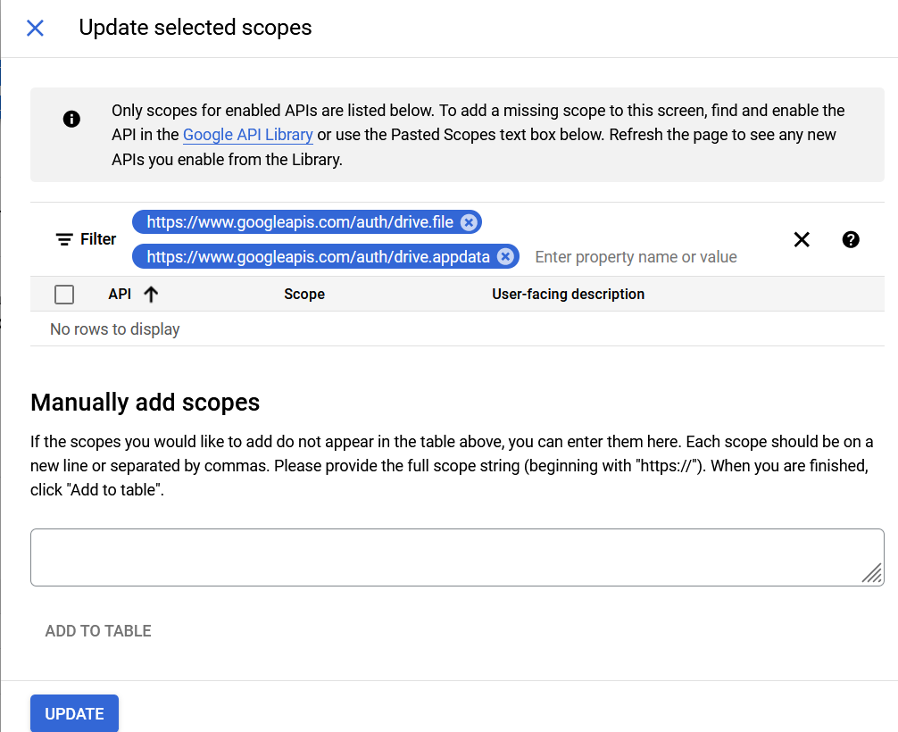
  
In **Test Users** screen, click **Save and Continue**.  
  
In the **Summary** screen, click **Back to Dashboard**.  
  

##Publish the Application  
In the **OAuth Consent Screen**, click **Publish**.
  
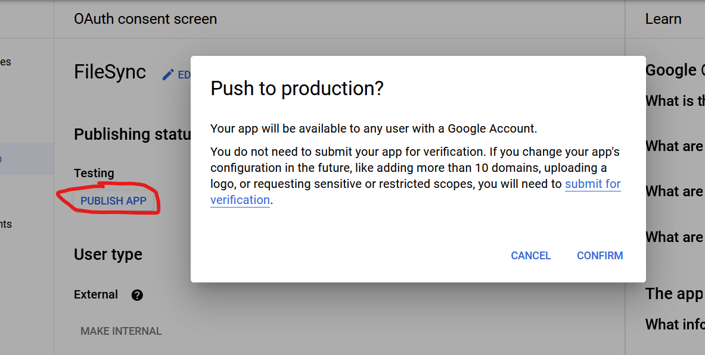  

##Create Credentials for the Application
From the **Credentials** page, click **Create Credentials**.  
  
Then select **OAuth client ID**.  

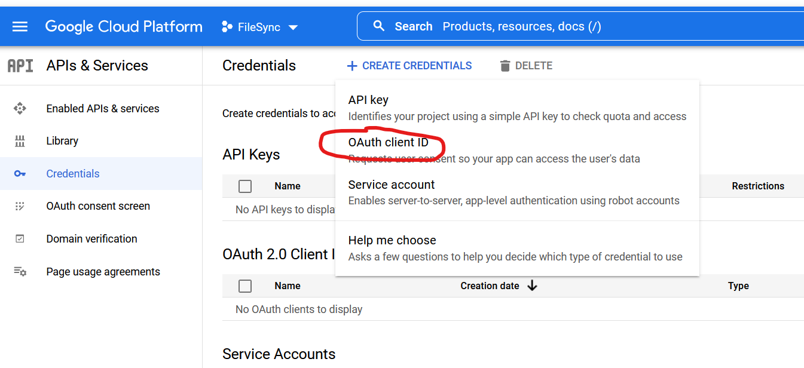  
  
Select **Desktop Application** type, and click **Create**.  

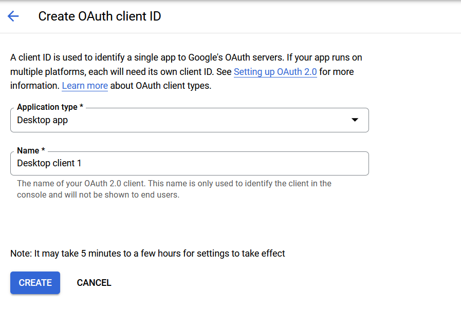  

Click **Download JSON** to get the credentials file to put in your project.
  
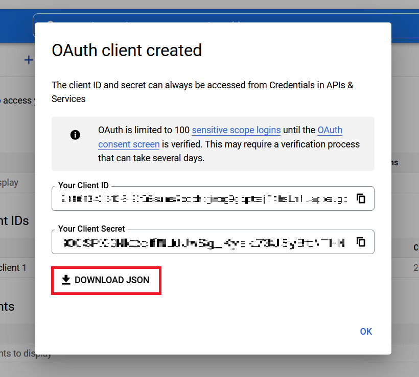  
